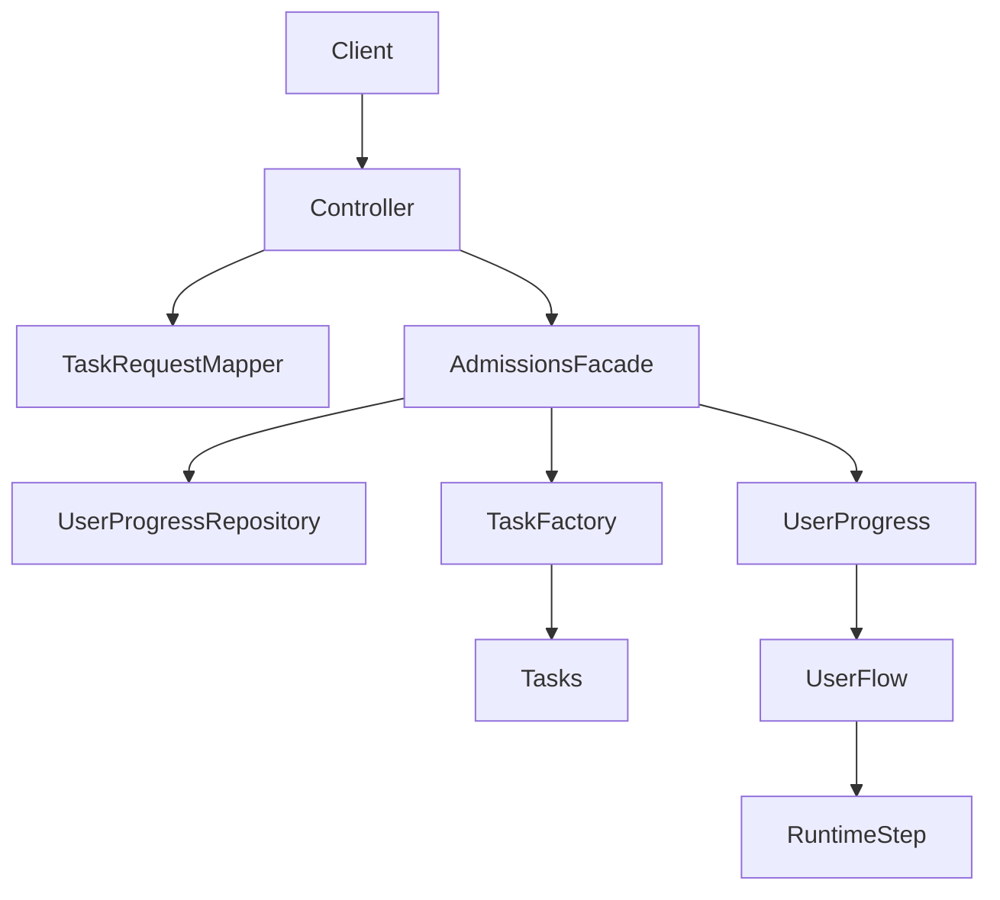

# Admissions Flow Service – Design Document

## Introduction

This document describes the architecture and design decisions behind the Admissions Flow Service.

The goal of the system is to model a multi-step admissions process in a way that is:
- easy to understand
- safe to evolve
- strict about execution rules
- flexible enough to support future product changes

The service is intentionally focused on backend flow execution logic. It does not include a frontend or persistent database layer.

---

## Problem Framing

The admissions process is not a single action. It is a sequence of steps, and some steps contain multiple ordered tasks.

Examples:
- a user must complete **Personal Details** before **IQ Test**
- the **Interview** step contains both **Schedule Interview** and **Perform Interview**
- some tasks are simple completion events
- some tasks decide pass/fail based on payload data

In addition, the assignment emphasizes future product changes. That means the design should not assume that all users always follow one rigid static path forever.

This led to one of the main design choices in the project: separating the **runtime flow assigned to a user** from any static configuration used to build it.

---

## High-Level Architecture

The system is organized into a small set of focused layers:

- **controller** – REST endpoints
- **facade** – orchestration and flow progression
- **runtime** – user-specific runtime flow model
- **task** – task implementations and task resolution
- **domain** – user progress and task execution state
- **repository** – persistence abstraction and in-memory implementation
- **dto** – request and response models
- **config / builder** – application wiring

At a high level, the execution path is:

1. a controller receives an HTTP request
2. the request is mapped into a typed DTO
3. the facade loads the user state
4. the facade validates whether the task is allowed
5. the task is resolved and executed
6. the user state is updated and persisted
7. the updated flow state is exposed back through the API



---

## Core Runtime Model

### 1. UserProgress

`UserProgress` is the central domain object for a user.

It stores:
- user identity
- email
- current step
- current task
- overall status
- executed task instances
- the user's personal `UserFlow`

This object represents the current truth of where the user stands in the admissions process.

### 2. UserFlow

`UserFlow` represents the runtime flow assigned to a specific user.

It contains an ordered list of `RuntimeStep` objects and acts as the source of truth for:
- which steps the user has
- in what order they appear
- what future changes may be injected for that specific user

This is a key architectural choice. Instead of driving all users through one shared global flow object, each user gets a runtime flow built from configuration.

### 3. RuntimeStep

`RuntimeStep` represents a single step inside a user's runtime flow.

It contains:
- a `StepName`
- an ordered list of `TaskName`s
- a `visibleInProgressBar` flag

The visibility flag was introduced to support product-driven scenarios where a step may exist for some users without necessarily appearing in the main progress UI for all users.

---

## Flow Execution Logic

The orchestration logic lives in `AdmissionsFacade`.

For every task completion request, the facade performs the following:

1. load the user from the repository
2. reject execution if the flow is already completed
3. initialize the first step if the user has not started yet
4. verify that the request step matches the user's current runtime step
5. verify that the requested task belongs to that step
6. verify that previous tasks in the same step were already completed
7. execute the task through the `TaskFactory`
8. record the resulting `TaskInstance`
9. either:
  - reject the user if the task failed
  - stay on the current step if the step is not complete yet
  - advance to the next runtime step if the step is complete
  - accept the user if the final step was completed

This gives the system deterministic behavior and strict control over flow progression.

---

## Why a User-Specific Runtime Flow?

A simpler solution would have been to keep one static ordered flow and let every user progress through it.

That approach works for a basic implementation, but it becomes restrictive once product requirements change.

For example, the assignment explicitly describes a case where a subset of users may need an additional step after IQ evaluation. In that kind of scenario, the system should be able to represent:

- steps that exist only for some users
- steps that may be inserted dynamically
- steps that may be visible or hidden in the UI depending on the case

Because of that, the design separates:

- **configuration used to create a runtime flow**
  from
- **the runtime flow actually assigned to the user**

This makes the system easier to evolve without pushing branching logic into every controller or task.

---

## API Design

The API is intentionally split into two responsibilities:

### AdmissionsController
Handles user-facing admissions state:
- create user
- get full flow
- get current state
- get user status

### TaskController
Handles task execution through one generic endpoint:

```http
PUT /admissions/users/{userId}/tasks/{taskName}
```

Instead of exposing one endpoint per task, the controller accepts a generic request shape and delegates payload mapping to `TaskRequestMapper`.

This improves extensibility:
- adding a new task does not require adding a new controller endpoint
- the external API remains consistent
- task-specific parsing stays outside the facade

---

## Task Execution Model

Each task encapsulates its own business rule and returns a `TaskStatus`.

Examples:
- `IQ_TEST` passes only if the score is above the threshold
- `PERFORM_INTERVIEW` passes only if the decision is `passed_interview`
- payment and similar tasks pass on successful completion payload

Task implementations are resolved through `TaskFactory`, which keeps orchestration code independent from concrete task classes.

This keeps responsibilities clean:
- the facade decides **when** a task may run
- the task itself decides **how** it is evaluated

---

## Validation Strategy

Validation is handled close to the input boundary.

Request DTOs validate their own required fields, using the `validations` package. This keeps invalid payloads from reaching business orchestration logic and helps the facade stay focused on flow control rather than low-level payload checks.

The general validation split is:

- **DTO layer** – shape and required field validation
- **Facade layer** – flow legality and execution order validation
- **Task layer** – task-specific business evaluation

---

## Main Design Patterns Used

### Facade
`AdmissionsFacade` is the central orchestration layer. It provides one focused entry point for admissions progression and hides coordination details from controllers.

### Factory
`TaskFactory` resolves task implementations by `TaskName`. This avoids hard-coding concrete task classes inside orchestration code.

### Strategy
Each task implementation behaves like a strategy: it receives a typed payload and decides whether that task passed or failed based on its own logic.

### Composition Root
`AdmissionsSystemBuilder` and `AppConfig` are responsible for wiring the system together. This keeps object creation separate from business behavior.

---

## Extensibility

<<<<<<< HEAD
### Adding a New Task

Adding a new task requires extending multiple layers of the system:

1. **Define a DTO**
   - Create a request object representing the task input
   - Add validation logic if needed

2. **Implement the Task**
   - Create a class implementing `Task<T>`
   - Implement the `process` method with the business logic

3. **Register the Task**
   - Add a new value to the `TaskName` enum
   - Register the task in the `TaskFactory`

4. **Expose via API**
   - Add an endpoint in the controller (or use the generic task execution endpoint)

5. **Attach to Flow**
   - Add the task to the appropriate step in the flow definition

This design ensures that tasks remain modular while being fully integrated into the system's flow and API.

### Adding a New Step

Adding a new step requires defining it within the flow configuration and associating it with its tasks:

1. **Define the Step**
   - Create a new step with a unique `StepName`
   - Assign an ordered list of tasks that belong to the step

2. **Update the Flow Definition**
   - Add the new step to the flow sequence in `FlowConfig`
   - Ensure the step is positioned correctly in the order

3. **Attach Tasks**
   - Each task must already be implemented and registered
   - Tasks define the execution logic, while the step defines their grouping and order

The flow execution logic remains unchanged, as it is fully driven by the configuration.

### Modifying the Flow

The flow structure can be modified by updating the configuration in `FlowConfig`:

- Reorder steps to change the progression sequence
- Add or remove steps
- Adjust the tasks within each step

Since the system's execution logic is driven entirely by the flow definition, 
no changes are required in the core orchestration (Facade) or task implementations.

This allows the system to evolve without introducing coupling or modifying existing logic.
=======
The design supports several kinds of future changes with limited impact:

### Add a New Task
Usually requires:
- adding a new `TaskName`
- implementing a task class
- registering it in the factory
- adding request mapping in `TaskRequestMapper`
- including it in the runtime flow configuration where relevant

### Change Task Order Inside a Step
Update the ordered task list in the runtime step configuration.
>>>>>>> dfd7b0b (Refactor admissions flow and add per-user runtime flow)

### Add or Remove a Step
Update the runtime flow creation logic in `FlowConfig`.

### Add Conditional or User-Specific Steps
The current architecture already supports this at the model level because each user owns a `UserFlow`. A future change can insert or modify steps for a specific user without redesigning the system.

This is one of the main reasons for introducing `UserFlow` and `RuntimeStep`.

---

## Tradeoffs

### In-Memory Repository
The current repository implementation is intentionally in memory.

Pros:
- simple
- fast to run
- ideal for the assignment

Cons:
- no persistence across restarts
- not production-ready for real deployment

### Explicit Runtime State
The system stores execution state explicitly in `UserProgress`.

Pros:
- easy to reason about
- easy to inspect in tests
- deterministic progression

Cons:
- requires careful synchronization between task execution and flow updates

### Enum-Based Task and Step Names
Using `TaskName` and `StepName` improves type safety and avoids fragile string-based orchestration.

Tradeoff:
- adding new tasks still requires code changes rather than pure configuration

Given the assignment scope, this was a reasonable balance between flexibility and clarity.

---

## Testing Approach

The test suite focuses on the most important behavioral guarantees:

- correct user creation
- correct progression through the flow
- enforcement of task order
- rejection on failing tasks
- prevention of duplicate task execution
- correctness of controller responses

This matches the nature of the system: the important thing is not just that the API exists, but that the flow rules are enforced consistently.

