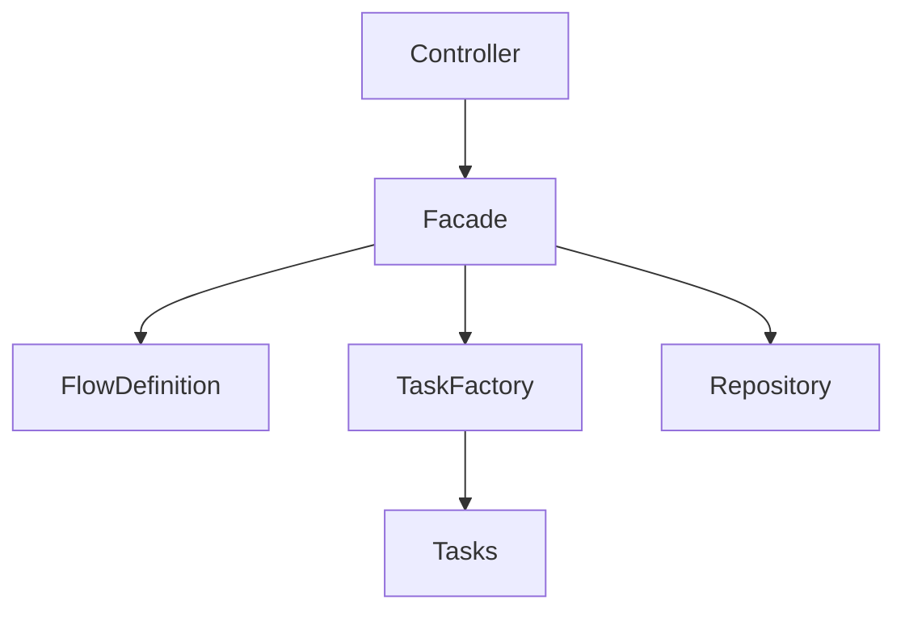

# Admissions Flow Service – Design Document

## Introduction

This document describes the design and architecture of the Admissions Flow system, focusing on its structure, key design decisions, and extensibility.

---

## Overview

The system models an admissions process as a sequence of steps, where each step contains one or more tasks.

Each user progresses independently, with their state updated based on task results. The system enforces correct execution order and ensures deterministic behavior.

---

## High-Level Architecture

The system follows a layered architecture:

- **Controller** – handles HTTP requests
- **Facade** – orchestrates flow execution
- **Flow Definition** – defines steps and order
- **Task Layer** – encapsulates business logic
- **Repository** – stores user state
- **Builder** – initializes and wires system components

### Flow of Execution

1. Controller receives request
2. Delegates to `AdmissionsFacade`
3. Facade resolves task via `TaskFactory`
4. Task executes and returns result
5. Facade updates and persists user state

---

## Core Design Principles

- **Separation of Concerns**  
  Each layer has a single responsibility

- **Extensibility**  
  New tasks and steps can be added with minimal changes

- **Type Safety**  
  Enums (`TaskName`, `StepName`) replace strings

- **Fail-Fast Validation**  
  Invalid inputs are rejected early (DTO level)

- **Explicit Flow Control**  
  Task order and progression are strictly enforced

---

## Flow Design

- A **Step** contains ordered tasks
- A **Task** processes input and returns `PASSED` / `FAILED`
- A step completes only when all tasks pass

### Execution Rules

- First task initializes the flow
- Tasks must belong to the current step
- Tasks must be executed in order
- Failure → user is **REJECTED**
- Completion → advance to next step
- Final step → user is **ACCEPTED**

---

## Design Patterns

- **Facade** – centralizes orchestration (`AdmissionsFacade`)
- **Factory** – resolves tasks (`TaskFactory`)
- **Strategy** – each task encapsulates its own logic

---

## Extensibility

### Add a Task
- Implement `Task<T>`
- Add to `TaskName`
- Register in factory

### Add a Step
- Define in `FlowConfig`

### Modify Flow
- Update `FlowConfig` only

**Key Idea:** flow logic is configuration-driven, not hardcoded.

---

## Tradeoffs

- **In-Memory Storage**  
  Simple and fast, but not persistent

- **DTO Validation**  
  Clean and early validation, but less flexible

- **Enums for Tasks**  
  Type-safe but requires code changes

- **Centralized Facade**  
  Clear control flow, but can grow in complexity

---

## Conclusion

The system is designed to be simple, structured, and extensible, enabling safe evolution of the admissions process while maintaining clear and predictable behavior.