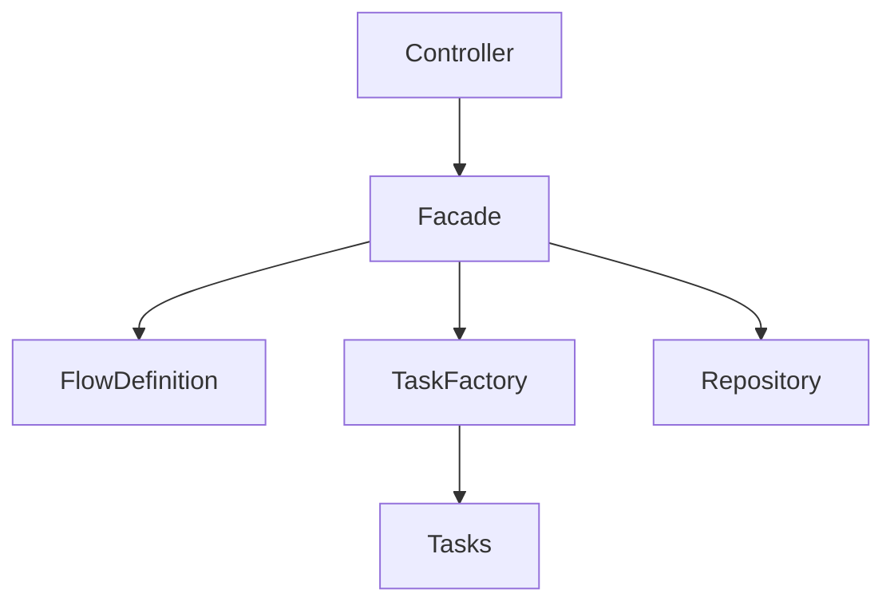

# Admissions Flow Service – Design Document

## Introduction

This document describes the design and architecture of the Admissions Flow system, focusing on its structure, key design decisions, and extensibility.

---

## Overview

The system models an admissions process as a sequence of steps, where each step contains one or more tasks.

Each user progresses independently, with their state updated based on task results. The system enforces correct execution order and ensures deterministic behavior.

---

## High-Level Architecture

The system follows a layered architecture:

- **Controller** – handles HTTP requests
- **Facade** – orchestrates flow execution
- **Flow Definition** – defines steps and order
- **Task Layer** – encapsulates business logic
- **Repository** – stores user state
- **Builder** – initializes and wires system components

### Flow of Execution

1. Controller receives request
2. Delegates to `AdmissionsFacade`
3. Facade resolves task via `TaskFactory`
4. Task executes and returns result
5. Facade updates and persists user state

---

## Core Design Principles

- **Separation of Concerns**  
  Each layer has a single responsibility

- **Extensibility**  
  New tasks and steps can be added with minimal changes

- **Type Safety**  
  Enums (`TaskName`, `StepName`) replace strings

- **Fail-Fast Validation**  
  Invalid inputs are rejected early (DTO level)

- **Explicit Flow Control**  
  Task order and progression are strictly enforced

---

## Flow Design

- A **Step** contains ordered tasks
- A **Task** processes input and returns `PASSED` / `FAILED`
- A step completes only when all tasks pass

### Execution Rules

- First task initializes the flow
- Tasks must belong to the current step
- Tasks must be executed in order
- Failure → user is **REJECTED**
- Completion → advance to next step
- Final step → user is **ACCEPTED**

---

## Design Patterns

- **Facade** – centralizes orchestration (`AdmissionsFacade`)
- **Factory** – resolves tasks (`TaskFactory`)
- **Strategy** – each task encapsulates its own logic

---

## Extensibility

### Adding a New Task

Adding a new task requires extending multiple layers of the system:

1. **Define a DTO**
   - Create a request object representing the task input
   - Add validation logic if needed

2. **Implement the Task**
   - Create a class implementing `Task<T>`
   - Implement the `process` method with the business logic

3. **Register the Task**
   - Add a new value to the `TaskName` enum
   - Register the task in the `TaskFactory`

4. **Expose via API**
   - Add an endpoint in the controller (or use the generic task execution endpoint)

5. **Attach to Flow**
   - Add the task to the appropriate step in the flow definition

This design ensures that tasks remain modular while being fully integrated into the system's flow and API.

### Adding a New Step

Adding a new step requires defining it within the flow configuration and associating it with its tasks:

1. **Define the Step**
   - Create a new step with a unique `StepName`
   - Assign an ordered list of tasks that belong to the step

2. **Update the Flow Definition**
   - Add the new step to the flow sequence in `FlowConfig`
   - Ensure the step is positioned correctly in the order

3. **Attach Tasks**
   - Each task must already be implemented and registered
   - Tasks define the execution logic, while the step defines their grouping and order

The flow execution logic remains unchanged, as it is fully driven by the configuration.

### Modifying the Flow

The flow structure can be modified by updating the configuration in `FlowConfig`:

- Reorder steps to change the progression sequence
- Add or remove steps
- Adjust the tasks within each step

Since the system's execution logic is driven entirely by the flow definition, 
no changes are required in the core orchestration (Facade) or task implementations.

This allows the system to evolve without introducing coupling or modifying existing logic.

**Key Idea:** flow logic is configuration-driven, not hardcoded.

---

## Tradeoffs

- **In-Memory Storage**  
  Simple and fast, but not persistent

- **DTO Validation**  
  Clean and early validation, but less flexible

- **Enums for Tasks**  
  Type-safe but requires code changes

- **Centralized Facade**  
  Clear control flow, but can grow in complexity

---

## Conclusion

The system is designed to be simple, structured, and extensible, enabling safe evolution of the admissions process while maintaining clear and predictable behavior.
